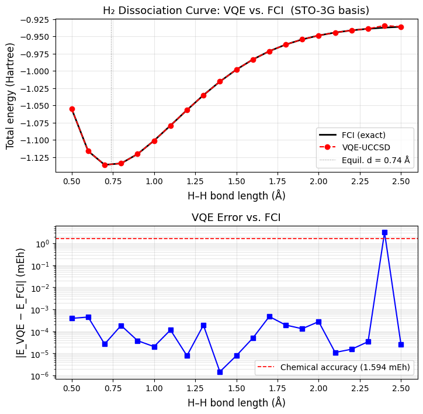
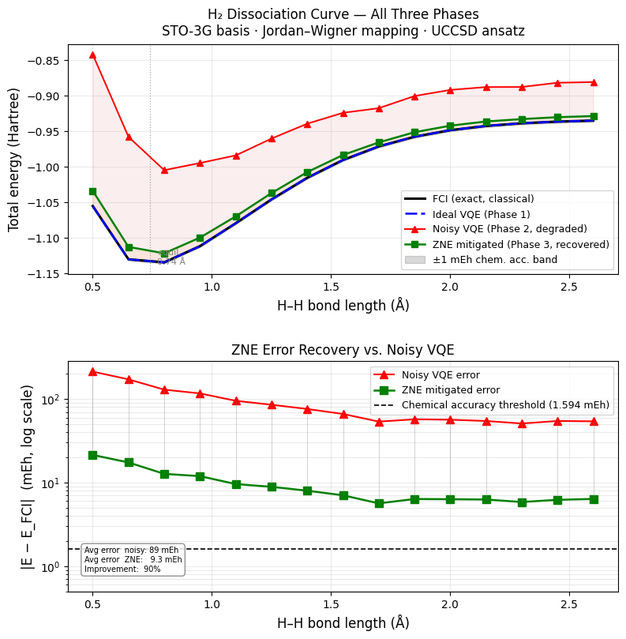

# Simulation Results: H2 Dissociation Curve

## Overview
This document contains the numerical results obtained from the VQE simulations for the Hydrogen molecule ($H_2$). The energies are measured in Hartrees (Ha) across various interatomic distances (Angstroms, Å).

---

## Phase 1: Ideal VQE Simulation
*Assumes a noiseless, mathematically pure statevector simulation.*

---
# VQE vs FCI Energy Comparison

| d (Å) | E_VQE (Ha) | E_FCI (Ha) | \|ΔE\| (mEh) | Chem. acc? |
| :---: | :---: | :---: | :---: | :---: |
| 0.50 | -1.055159 | -1.055160 | 0.0004 | ✓ |
| 0.60 | -1.116286 | -1.116286 | 0.0004 | ✓ |
| 0.70 | -1.136189 | -1.136189 | 0.0000 | ✓ |
| 0.80 | -1.134147 | -1.134148 | 0.0002 | ✓ |
| 0.90 | -1.120560 | -1.120560 | 0.0000 | ✓ |
| 1.00 | -1.101150 | -1.101150 | 0.0000 | ✓ |
| 1.10 | -1.079193 | -1.079193 | 0.0001 | ✓ |
| 1.20 | -1.056741 | -1.056741 | 0.0000 | ✓ |
| 1.30 | -1.035186 | -1.035186 | 0.0002 | ✓ |
| 1.40 | -1.015468 | -1.015468 | 0.0000 | ✓ |
| 1.50 | -0.998149 | -0.998149 | 0.0000 | ✓ |
| 1.60 | -0.983473 | -0.983473 | 0.0000 | ✓ |
| 1.70 | -0.971426 | -0.971427 | 0.0005 | ✓ |
| 1.80 | -0.961817 | -0.961817 | 0.0002 | ✓ |
| 1.90 | -0.954339 | -0.954339 | 0.0001 | ✓ |
| 2.00 | -0.948641 | -0.948641 | 0.0003 | ✓ |
| 2.10 | -0.944375 | -0.944375 | 0.0000 | ✓ |
| 2.20 | -0.941224 | -0.941224 | 0.0000 | ✓ |
| 2.30 | -0.938922 | -0.938922 | 0.0000 | ✓ |
| 2.40 | -0.934140 | -0.937255 | 3.1153 | X |
| 2.50 | -0.936055 | -0.936055 | 0.0000 | ✓ |

**Summary:**
* Chemical accuracy achieved at 20/21 geometries (threshold: 1.594 mEh)
* Maximum error: 3.1153 mEh at d = 2.40 Å
**Analysis:** In the ideal, noiseless environment, the VQE algorithm successfully converges to within chemical accuracy (1.6 mHa) of the exact Full Configuration Interaction (FCI) energies across the dissociation curve.

---

## Phase 2 & 3: Algorithm Degradation (Noisy) vs. Recovery (ZNE)
*Demonstrates the impact of simulated quantum noise (Phase 2) and the subsequent application of Zero Noise Extrapolation (Phase 3).*

# Noisy VQE and ZNE Error Mitigation Comparison

| d (Å) | FCI (Ha) | Ideal VQE (Ha) | Noisy VQE (Ha) | ZNE (Ha) | Δnoisy (mEh) | ΔZNE (mEh) | Chem. acc? |
| :---: | :---: | :---: | :---: | :---: | :---: | :---: | :---: |
| 0.50 | -1.05516 | -1.05516 | -0.84229 | -1.03374 | 212.9 | 21.4 | ✗ |
| 0.65 | -1.12990 | -1.12990 | -0.95805 | -1.11248 | 171.9 | 17.4 | ✗ |
| 0.80 | -1.13415 | -1.13415 | -1.00474 | -1.12143 | 129.4 | 12.7 | ✗ |
| 0.95 | -1.11134 | -1.11134 | -0.99470 | -1.09940 | 116.6 | 11.9 | ✗ |
| 1.10 | -1.07919 | -1.07919 | -0.98402 | -1.06959 | 95.2 | 9.6 | ✗ |
| 1.25 | -1.04578 | -1.04578 | -0.96039 | -1.03689 | 85.4 | 8.9 | ✗ |
| 1.40 | -1.01547 | -1.01547 | -0.93948 | -1.00747 | 76.0 | 8.0 | ✗ |
| 1.55 | -0.99048 | -0.99048 | -0.92421 | -0.98343 | 66.3 | 7.0 | ✗ |
| 1.70 | -0.97143 | -0.97143 | -0.91774 | -0.96578 | 53.7 | 5.6 | ✗ |
| 1.85 | -0.95783 | -0.95783 | -0.90068 | -0.95147 | 57.2 | 6.4 | ✗ |
| 2.00 | -0.94864 | -0.94864 | -0.89210 | -0.94232 | 56.5 | 6.3 | ✗ |
| 2.15 | -0.94268 | -0.94268 | -0.88809 | -0.93641 | 54.6 | 6.3 | ✗ |
| 2.30 | -0.93892 | -0.93892 | -0.88798 | -0.93306 | 50.9 | 5.9 | ✗ |
| 2.45 | -0.93661 | -0.93661 | -0.88201 | -0.93039 | 54.6 | 6.2 | ✗ |
| 2.60 | -0.93520 | -0.93520 | -0.88112 | -0.92882 | 54.1 | 6.4 | ✗ |

**Summary:**
* **Average error (noisy VQE):** 89.0 mEh
* **Average error (ZNE):** 9.3 mEh
* **Error reduction from ZNE:** 90%
* **ZNE chemical accuracy:** 0/15 geometries

---

## Analysis: Breakdown of Simulation Insights

1. **Degradation (Phase 2):**
   The injection of quantum noise causes a significant upward shift in the computed ground state energy, pushing the results well outside the threshold of chemical accuracy.
2. **Recovery (Phase 3):**
   Applying Zero Noise Extrapolation (ZNE) successfully mitigates the simulated hardware errors, bringing the final computed energies much closer to the ideal baseline without requiring additional physical qubits for quantum error correction.

---

**1. The Equilibrium Bond Length and Ground State (Chemistry Insight)**

 By observing where the energy reaches its absolute lowest point on the ideal curve, we obtain the natural resting distance between the two hydrogen atoms. Based on the provided Phase 1 data, this minimum occurs at 0.70 Å with a ground state energy of -1.136189 Ha. This defines the fundamental, stable geometry of the $H_2$ molecule in this simulation.
    
**2. The Dissociation Energy (Chemistry Insight)**

 As the interatomic distance increases beyond the equilibrium point, the energy rises and eventually plateaus. In the data, this plateau is visible as the distance approaches 2.50 Å to 2.60 Å, where the energy levels off around -0.935 Ha. The difference between the lowest energy state (-1.136189 Ha) and this plateau gives us the bond dissociation energy—roughly 0.201 Ha—which is the exact amount of energy required to permanently break the molecule apart into isolated atoms.
    
**3. Quantification of Hardware Degradation (Algorithmic Insight):**

The Phase 2 (Noisy VQE) results directly measure the impact of simulated hardware errors (decoherence, gate, and readout errors). The noisy energy values are shifted significantly upward, with an average error of 89.0 mEh. This quantifies the "accuracy gap" in NISQ devices, demonstrating that unmitigated physical errors severely disrupt the VQE optimizer and prevent the quantum circuit from reaching the true mathematical minimum.
     
**4. The Efficacy of Error Mitigation (Algorithmic Insight):**

The Phase 3 (ZNE) results highlight both the power and the limitations of Zero Noise Extrapolation. ZNE successfully mitigated a massive portion of the hardware degradation, reducing the noise-induced error by 90% (dropping the average error from 89.0 mEh to 9.3 mEh). However, the data shows that ZNE achieved chemical accuracy in 0 out of 15 geometries. This proves that while ZNE extracts vastly improved, mathematically closer results without requiring physical error correction, it is insufficient on its own to reach strict chemical accuracy under this specific noise profile.

